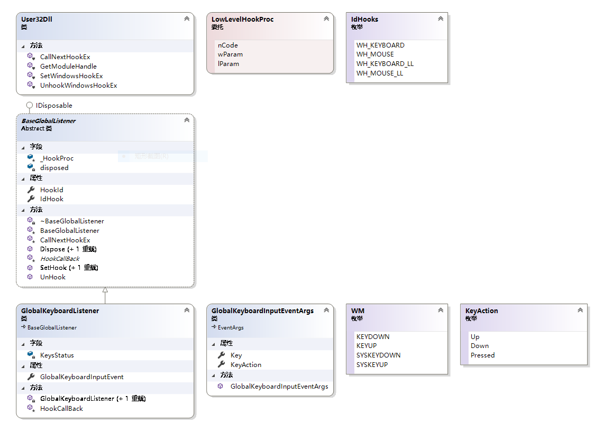
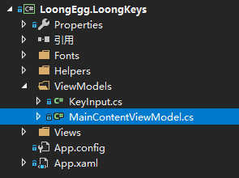

# LoongKeys
WPF版的键盘指示器<br>A WPF application of low-level keyboard hook(or keyboard indicator/monitor,
 use **NONE 3rd party dependency** and **NONE Nuget**)

# 如果你懂中文
在B站搜索 **香辣恐龙蛋** 有本项目完整的开发过程
https://www.bilibili.com/video/av89450038/

# If you can not read chinese
The comment of this project was almost written in both 中文 and English


# The core: keyboard hook(核心的键盘输入程序)
It class relationship is easy to learn.
You can inherit from the **BaseLobalListenner** to creat your own 
mouse listener i did not implemetn yet.


# How to use
You can refer to my WPF solution<br>
**LoongEgg.LoongKeys\ViewModels\MainContentViewModel.cs**<br>

```c#
        /// <summary>
        ///     全局键盘监控器
        /// </summary>
        readonly GlobalKeyboardListener listenerOnKeyboard;// step1: insert a listener into you VIEW MODEL

        /// <summary>
        ///  The Constructor of <see cref="MainContentViewModel"/>
        /// </summary>
        public MainContentViewModel()
        {
            listenerOnKeyboard = new GlobalKeyboardListener();// step2: initialize the listener
            listenerOnKeyboard.SetHook();// step3:let the hool start work
            listenerOnKeyboard.GlobalKeyboardInputEvent += GlobalKeyboard_InputEvent;// step4:register a event handler
        }

        /// <summary>
        ///     Raised when a keybord input happen
        /// </summary>
        ///     <param name="sender">
        ///         The <see cref="GlobalKeyboardListener"/>
        ///     </param>
        ///     <param name="e">
        ///         A Event Args Defined in name space <see cref="KeyboardHook"/>
        ///     </param>
        private void GlobalKeyboard_InputEvent(object sender, GlobalKeyboardInputEventArgs e)
        {   
             // step5: your logical
        }

```


# Enjoy it!
